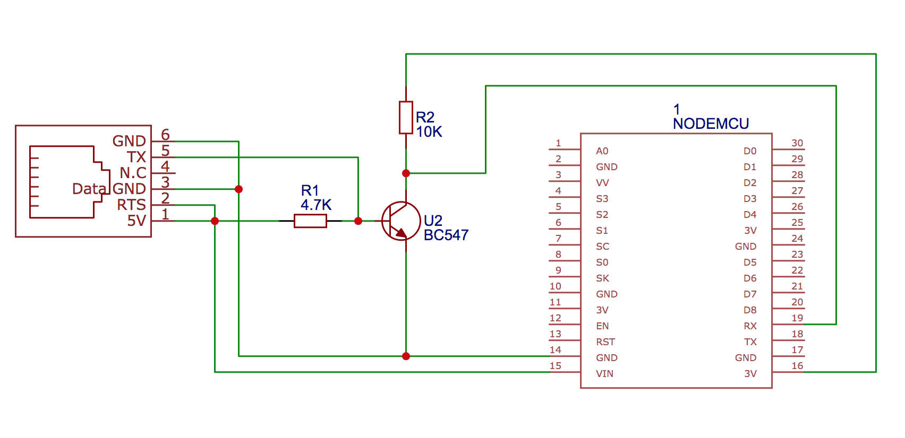

# esphome-p1reader
ESPHome custom component for reading P1 data from electricity meters. Designed for Swedish meters that implements the specification defined in the [Swedish Energy Industry Recommendation For Customer Interfaces](https://www.energiforetagen.se/forlag/elnat/branschrekommendation-for-lokalt-kundgranssnitt-for-elmatare/) version 1.3 and above.

Please note that the project currently doesn't support the Aidon meter from Tekniska Verken since that meter outputs the data in a binary format according to an earlier version (1.2) of the above mentioned recommendation.

## Verified meter hardware / supplier
* [Sagemcom T211](https://www.ellevio.se/globalassets/uploads/2020/nya-elmatare/ellevio_produktblad_fas3_t211_web2.pdf) / Ellevio
* [Landis+Gyr E360](https://eu.landisgyr.com/blog-se/e360-en-smart-matare-som-optimerarden-totala-agandekostnaden)

https://github.com/psvanstrom/esphome-p1reader/issues/4#issuecomment-810794020

## Hardware
I have used an ESP-12 based NodeMCU for my circuit. Most ESP-12/ESP-32 based controllers would probably work. The P1 port on the meter provides 5V up to 250mA which makes it possible to power the circuit directly from the P1 port.

### Parts
- 1 NodeMCU or equivalent ESP-12 / ESP-32 microcontroller
- 1 BC547 NPN transistor
- 1 4.7kOhm Resistor
- 1 10kOhm Resistor
- 1 RJ12 6P6C port
- 1 RJ12 to RJ12 cable (6 wires)

### Wiring
The circuit is very simple, basically the 5V TX output on the P1 connector is converted to 3.3V and inverted by the transistor and connected to the UART0 RX pin on the microcontroller. The RTS (request to send) pin is pulled high so that data is sent continously and GND and 5V is taken from the P1 connector to drive the microcontroller.



## Installation
Clone the repository and create a companion `secrets.yaml` file with the following fields:
```
wifi_ssid: <your wifi SSID>
wifi_password: <your wifi password>
fallback_password: <fallback AP password>
hass_api_password: <the Home Assistant API password>
ota_password: <The OTA password>
```
Make sure to place the `secrets.yaml` file in the root path of the cloned project. The `fallback_password` and `ota_password` fields can be set to any password before doing the initial upload of the firmware.


Prepare the microcontroller with ESPHome before you connect it to the circuit:
- Install the `esphome` [command line tool](https://esphome.io/guides/getting_started_command_line.html)
- Plug in the microcontroller to your USB port and run `esphome p1reader.yaml run` to flash the firmware
- Remove the USB connection and connect the microcontroller to the rest of the circuit and plug it into the P1 port.
- If everything works, your Home Assistant will now auto detect your new ESPHome integration.

You can check the logs by issuing `esphome p1reader.yaml logs` (or use the super awesome ESPHome dashboard available as a Hass.io add-on or standalone). The logs should output data similar to this every 10 seconds when using `DEBUG` loglevel:
```
[18:40:01][D][data:264]: /ELL5\253833635_A
[18:40:01][D][data:264]:
[18:40:01][D][data:264]: 0-0:1.0.0(210217184019W)
[18:40:01][D][data:264]: 1-0:1.8.0(00006678.394*kWh)
[18:40:01][D][data:264]: 1-0:2.8.0(00000000.000*kWh)
[18:40:01][D][data:264]: 1-0:3.8.0(00000021.988*kvarh)
[18:40:01][D][data:264]: 1-0:4.8.0(00001020.971*kvarh)
[18:40:01][D][data:264]: 1-0:1.7.0(0001.727*kW)
[18:40:01][D][data:264]: 1-0:2.7.0(0000.000*kW)
[18:40:01][D][data:264]: 1-0:3.7.0(0000.000*kvar)
[18:40:01][D][data:264]: 1-0:4.7.0(0000.309*kvar)
[18:40:01][D][data:264]: 1-0:21.7.0(0001.023*kW)
[18:40:01][D][data:264]: 1-0:41.7.0(0000.350*kW)
[18:40:01][D][data:264]: 1-0:61.7.0(0000.353*kW)
[18:40:01][D][data:264]: 1-0:22.7.0(0000.000*kW)
[18:40:01][D][data:264]: 1-0:42.7.0(0000.000*kW)
[18:40:01][D][data:264]: 1-0:62.7.0(0000.000*kW)
[18:40:01][D][data:264]: 1-0:23.7.0(0000.000*kvar)
[18:40:01][D][data:264]: 1-0:43.7.0(0000.000*kvar)
[18:40:01][D][data:264]: 1-0:63.7.0(0000.000*kvar)
[18:40:01][D][data:264]: 1-0:24.7.0(0000.009*kvar)
[18:40:01][D][data:264]: 1-0:44.7.0(0000.161*kvar)
[18:40:01][D][data:264]: 1-0:64.7.0(0000.138*kvar)
[18:40:01][D][data:264]: 1-0:32.7.0(240.3*V)
[18:40:01][D][data:264]: 1-0:52.7.0(240.1*V)
[18:40:01][D][data:264]: 1-0:72.7.0(241.3*V)
[18:40:01][D][data:264]: 1-0:31.7.0(004.2*A)
[18:40:01][D][data:264]: 1-0:51.7.0(001.6*A)
[18:40:01][D][data:264]: 1-0:71.7.0(001.7*A)
[18:40:01][D][data:264]: !7945
[18:40:01][I][crc:275]: Telegram read. CRC: 7945 = 7945. PASS = YES
```

The last row contains the CRC check. If you constantly get invalid CRC there might be something wrong with the serial communication.

## Technical documentation
Specification overview:
https://www.tekniskaverken.se/siteassets/tekniska-verken/elnat/aidonfd-rj12-han-interface-se-v13a.cleaned.pdf

OBIS codes:
https://tech.enectiva.cz/en/installation-instructions/others/obis-codes-meaning/

P1 hardware info (in Dutch):
http://domoticx.com/p1-poort-slimme-meter-hardware/
