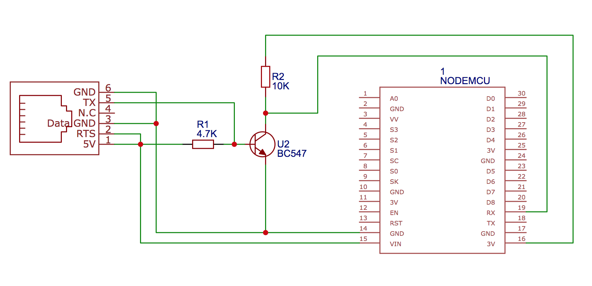
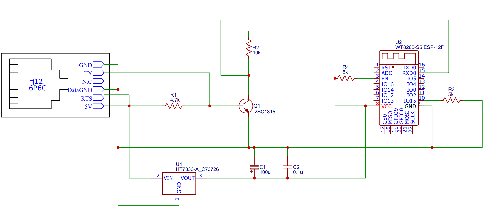

# esphome-p1reader

An [ESPHome](https://esphome.io/) external component for reading P1 data from smart electricity meters and exposing it to Home Assistant. It is designed for Swedish meters that implement the [Swedish Energy Industry Recommendation For Customer Interfaces](https://www.energiforetagen.se/forlag/elnat/branschrekommendation-for-lokalt-kundgranssnitt-for-elmatare/) (version 1.3 and above).

It handles both the **ASCII** telegram format (most meters) and the binary **HDLC** format (used by some Aidon meters).

> [!NOTE]
> The current `main` is tested with ESPHome `2026.6.4`. Make sure your ESPHome is up to date if you run into compile problems.

## Contents

- [Verified meters](#verified-meters)
- [Hardware](#hardware)
- [Installation](#installation)
- [Verifying the output](#verifying-the-output)
- [Controlling the update frequency](#controlling-the-update-frequency)
- [Running on other boards](#running-on-other-boards)
- [Sharing the port with a second device (repeater)](#sharing-the-port-with-a-second-device-repeater)
- [Technical documentation](#technical-documentation)

## Verified meters

The following meter / supplier combinations have been verified to work:

* [Sagemcom T211](https://www.ellevio.se/globalassets/content/el/elmatare-produktblad-b2c/ellevio_produktblad_fas3_t211_web2.pdf) / Ellevio & Skånska Energi ([Info, port activation, etc.](https://www.ellevio.se/privat/om-din-el/elen-i-hemmet/forsta-din-elmatare/))
* [Landis+Gyr E360](https://www.landisgyr.eu/product/landisgyr-e360/)
* [Itron A300](https://natkraftboras.se/elnat/elnatsavtal/din-elmatare/) / Borås Elnät
* [S34U18 (Sanxing SX631)](https://www.vattenfalleldistribution.se/globalassets/1.-privat/elnatsanslutning/matarbyte/nya-elmataren/vattenfall-eldistribution-anvandarmanual-elmatare-vers.-1.05.pdf) / Vattenfall
* [KAIFA MA304H4E](https://www.nackaenergi.se/elnat/sa-fungerar-din-elmatare) / Nacka Energi
* [KAIFA CL109](https://www.oresundskraft.se/globalassets/pdf/matarbyte/matarmanual_utokad.pdf) / Öresundskraft
* [Aidon](https://tekniskaverken.se/privat/elnat/kunskap/elmatare-elforbrukning) / Tekniska Verken
* [Kamstrup Omnia](https://www.goteborgenergi.se/kundservice/elmatarbyte/sa-fungerar-din-elmatare) / Göteborgs Energi

> [!NOTE]
> There's a bug in older Landis+Gyr E360 firmware causing it to stop sending out data after a while. See [this comment](https://github.com/psvanstrom/esphome-p1reader/issues/4#issuecomment-810794020) for more info.

> [!WARNING]
> Do not confuse the KAIFA MA304H4**E** with the MA304H4**D**; the latter uses M-Bus instead of P1. Apart from being incompatible protocols, M-Bus pin 1 carries 27V instead of 5V and will fry your P1 equipment.

## Hardware

This project uses an ESP-12 based NodeMCU, but a cheaper Wemos D1 mini (or most other ESP-based controllers) will also work. The P1 port on the meter provides 5V at up to 250mA, which is enough to power the circuit directly from the P1 port.

### Parts

- 1 NodeMCU, Wemos D1 mini or equivalent ESP-12 / ESP-32 microcontroller
- 1 BC547 / 2N3904 NPN transistor
- 1 4.7kOhm resistor
- 1 10kOhm resistor
- 1 RJ12 6P6C port
- 1 RJ12 to RJ12 cable (6 wires)

### Wiring

The circuit is very simple: the 5V TX output on the P1 connector is inverted and level-shifted to 3.3V by the transistor and connected to the UART0 RX pin on the microcontroller. The RTS (request to send) pin is pulled high so that data is sent continuously, and GND and 5V are taken from the P1 connector to power the microcontroller.

> [!TIP]
> **You no longer need the transistor just to invert the signal.** Since this component was first written, ESPHome added software signal inversion via `inverted: true` on the `rx_pin` (see the [UART documentation](https://esphome.io/components/uart/)). Because the P1 data line is open-collector, on many meters you can skip the inverting transistor entirely and instead add a pull-up resistor from RX to 3.3V and set `inverted: true` in the config. This is exactly the [ESP32 wiring](#esp32) shown below.
>
> If you *do* build the transistor circuit below, leave `inverted: true` **off**, since the hardware already inverts the signal, and enabling software inversion as well would cancel it out.

#### NodeMCU ESP-12


#### Wemos D1 mini


#### Barebone ESP-12 with voltage regulators and capacitors
The schematic shows a 2SC1815 NPN transistor (that's what was on hand); either transistor listed in the parts section works fine.


### PCBs and enclosures

Community-made boards you can build on:

- **[Naesstrom](https://github.com/Naesstrom)**: a PCB for the Wemos D1 mini with a 3D-printable enclosure. [PCB](https://oshwlab.com/Naesstrom/esphome-p1reader) · [enclosure](https://www.thingiverse.com/thing:4961372).

  <p float="left">
      
      
  </p>

- **[EHjortberg](https://github.com/ehjortberg)**: a PCB based on an ESP07 module with a 3D-printable enclosure. [Details](https://github.com/ehjortberg/kicad-p1-port-thingie).

  <p float="left">
    
  </p>

## Installation

You don't need to clone this repository. The example [`p1reader.yaml`](./p1reader.yaml) pulls the component straight from GitHub via `external_components`:

```yaml
external_components:
  - source:
      type: git
      url: https://github.com/psvanstrom/esphome-p1reader
      #ref: main   # pin to a branch or tag (defaults to the repo default branch)
    refresh: 0s    # always re-fetch on build; raise to e.g. 1d once you're settled
```

**1. Get the config and secrets.** Grab [`p1reader.yaml`](./p1reader.yaml) (or one of the [samples](./samples)) and create a companion `secrets.yaml` file next to it:

```yaml
wifi_ssid: <your wifi SSID>
wifi_password: <your wifi password>
fallback_password: <fallback AP password>
encryption_key: <the encryption key shared with Home Assistant>
ota_password: <the OTA password>
```

See the [Native API Component documentation](https://esphome.io/components/api.html#configuration-variables) for more on the encryption key (that page can also generate one for you). The `fallback_password` and `ota_password` can be any password you choose before the first upload.

> [!TIP]
> If your supplier uses an **Aidon 6442SE** or **Aidon 653X** meter, it may still send data in the HDLC protocol rather than ASCII. Start from the [HDLC sample configuration](./samples/p1reader_hdlc.yaml), which selects the HDLC parser.

**2. Flash the firmware** (do this before connecting the board to the circuit):

- Install the `esphome` [command line tool](https://esphome.io/guides/getting_started_command_line.html).
- Plug the microcontroller into your USB port and run `esphome run p1reader.yaml`.
- Disconnect USB, wire the microcontroller into the rest of the circuit, and plug it into the P1 port.
- Once it's running, Home Assistant will auto-detect the new ESPHome integration.

> [!NOTE]
> To develop against a local checkout instead, clone the repo and replace the `source:` block above with `source: ./components` (the path to this repo's `components` folder, relative to your YAML).

## Verifying the output

Check the logs with `esphome p1reader.yaml logs` (or use the ESPHome dashboard, available as a Home Assistant add-on or standalone). At the `DEBUG` log level you should see a telegram similar to the following roughly every 10 seconds:

<details>
<summary>Example log output</summary>

```
[18:40:01][D][data:264]: /ELL5\253833635_A
[18:40:01][D][data:264]:
[18:40:01][D][data:264]: 0-0:1.0.0(210217184019W)
[18:40:01][D][data:264]: 1-0:1.8.0(00006678.394*kWh)
[18:40:01][D][data:264]: 1-0:2.8.0(00000000.000*kWh)
[18:40:01][D][data:264]: 1-0:3.8.0(00000021.988*kvarh)
[18:40:01][D][data:264]: 1-0:4.8.0(00001020.971*kvarh)
[18:40:01][D][data:264]: 1-0:1.7.0(0001.727*kW)
[18:40:01][D][data:264]: 1-0:2.7.0(0000.000*kW)
[18:40:01][D][data:264]: 1-0:3.7.0(0000.000*kvar)
[18:40:01][D][data:264]: 1-0:4.7.0(0000.309*kvar)
[18:40:01][D][data:264]: 1-0:21.7.0(0001.023*kW)
[18:40:01][D][data:264]: 1-0:41.7.0(0000.350*kW)
[18:40:01][D][data:264]: 1-0:61.7.0(0000.353*kW)
[18:40:01][D][data:264]: 1-0:22.7.0(0000.000*kW)
[18:40:01][D][data:264]: 1-0:42.7.0(0000.000*kW)
[18:40:01][D][data:264]: 1-0:62.7.0(0000.000*kW)
[18:40:01][D][data:264]: 1-0:23.7.0(0000.000*kvar)
[18:40:01][D][data:264]: 1-0:43.7.0(0000.000*kvar)
[18:40:01][D][data:264]: 1-0:63.7.0(0000.000*kvar)
[18:40:01][D][data:264]: 1-0:24.7.0(0000.009*kvar)
[18:40:01][D][data:264]: 1-0:44.7.0(0000.161*kvar)
[18:40:01][D][data:264]: 1-0:64.7.0(0000.138*kvar)
[18:40:01][D][data:264]: 1-0:32.7.0(240.3*V)
[18:40:01][D][data:264]: 1-0:52.7.0(240.1*V)
[18:40:01][D][data:264]: 1-0:72.7.0(241.3*V)
[18:40:01][D][data:264]: 1-0:31.7.0(004.2*A)
[18:40:01][D][data:264]: 1-0:51.7.0(001.6*A)
[18:40:01][D][data:264]: 1-0:71.7.0(001.7*A)
[18:40:01][D][data:264]: !7945
[18:40:01][I][crc:275]: Telegram read. CRC: 7945 = 7945. PASS = YES
```

</details>

The default log level is `INFO`, since logging affects performance. The last row of each telegram contains the CRC check. If you constantly get invalid CRCs, there is likely something wrong with the serial communication.

## Controlling the update frequency

Sensor values are published **once per telegram received from the meter**, so the update rate is set by how often your meter sends data, typically every 1 to 10 seconds depending on the meter and its firmware. The component's polling interval is auto-tuned from the baud rate and `rx_buffer_size` purely so it can keep up with the incoming bytes; it is **not** a way to slow down updates (forcing it slower just causes buffer overflows and CRC errors).

To reduce how often values reach Home Assistant, add a standard ESPHome [sensor filter](https://esphome.io/components/sensor/#sensor-filters) to the sensors you care about:

```yaml
sensor:
  - platform: p1reader
    p1reader_id: p1reader_esp
    momentary_active_import:
      name: "Momentary Active Import"
      filters:
        - throttle_average: 10s   # average over 10s, then publish once
    cumulative_active_import:
      name: "Cumulative Active Import"
      filters:
        - throttle: 10s           # simply drop intermediate values
```

Use `throttle_average` for instantaneous values (power, current, voltage) and `throttle` for cumulative meter totals. Apply the filter to each sensor you want to slow down.

## Running on other boards

Because the underlying P1 specification is, for practical purposes, identical across most of Europe/EU (Norway being the exception), this component works with many kinds of ESPHome-capable hardware, both DIY and commercial. The trick is to combine that hardware with the code here, which handles the Swedish selection of data values. (ESPHome's built-in DSMR component follows the Dutch specification instead.) Finland and Denmark appear to use the same configuration as Sweden.

### ESP32

The ESP32 needs an external power supply, as it can't run off the low current available from the P1 port. Use the hardware UART on GPIO3, with a 1k pull-up resistor from RXD to 3V3.

```yaml
uart:
  id: uart_bus
  rx_pin:
    number: GPIO3
    inverted: true
  baud_rate: 115200
```


Image credit: https://github.com/Josverl/micropython-p1meter

### Seeed Studio XIAO ESP32C3

The [Seeed Studio XIAO ESP32C3](https://wiki.seeedstudio.com/XIAO_ESP32C3_Getting_Started/) is a tiny ESP32-C3 board that runs this code with just a single 4.7kOhm pull-up resistor from RX to 3V3. It has been reported stable over several days of use (see [issue #73](https://github.com/psvanstrom/esphome-p1reader/issues/73)).


Use `board: esp32-c3-devkitm-1` and read on GPIO20 (labelled D7 / RX on the board):

```yaml
esp32:
  board: esp32-c3-devkitm-1
  variant: esp32c3
  framework:
    type: arduino

uart:
  id: uart_bus
  baud_rate: 115200
  rx_pin:
    number: GPIO20   # D7 / RX
    inverted: true
```

> [!NOTE]
> Do **not** use `board: seeed_xiao_esp32c3`, as it fails to compile. Use `esp32-c3-devkitm-1` as shown above.

> [!TIP]
> The XIAO already has ~4.5µF on its 5V input, so don't add extra capacitance there. Extra capacitance can cause cold-boot problems on a low-current source like the P1 port.

### SmartyReader P1

Weigu's [SmartyReader P1](http://weigu.lu/microcontroller/smartyReader_P1/index.html) runs this code with a few small adaptions. It's based on an ESP8266 Wemos D1 mini pro with fewer components.

1. Set the board:

   ```yaml
   esp8266:
     board: d1_mini_pro
   ```

2. Invert the RX pin (the TX pin isn't used):

   ```yaml
   uart:
     id: uart_bus
     rx_pin:
       number: 3
       inverted: true
     baud_rate: 115200
   ```

The `inverted` flag has been available since ESPHome 2021.12.0.

### Slimmelezer(+)

Marcel Zuidwijk's [Slimmelezer+](https://www.zuidwijk.com/product/slimmelezer-plus/) is a custom board with a P1 interface that is software-equivalent to the Wemos D1 mini, so this code runs on it directly. (The non-`+` version works too.)

1. Set the board:

   ```yaml
   esp8266:
     board: d1_mini
   ```

2. Set the RX pin used by the Slimmelezer:

   ```yaml
   uart:
     id: uart_bus
     baud_rate: 115200
     rx_pin: D7
     rx_buffer_size: 3072
   ```

See the [Slimmelezer sample configuration](./samples/slimmelezer.yaml), which uses `!secret` for all site-specific configuration (see [Installation](#installation)).

## Sharing the port with a second device (repeater)

The component can act as an active repeater: with `repeat_to_tx: true`, every byte it reads from the meter is echoed straight out the UART **TX** pin, so a second P1 device (e.g. a Tibber Pulse) can share a single P1 port without an active splitter.

```yaml
p1reader:
  - id: p1reader_esp
    uart_id: uart_bus
    repeat_to_tx: true
```

> [!WARNING]
> This requires additional hardware and is **off by default**. The TX pin needs the same treatment as RX: the ESP's 3.3 V output must be **inverted and level-shifted to a 5 V open-collector signal** (a second transistor stage, mirroring the RX circuit); wiring TX directly to the second device will not work reliably. Make sure your `uart:` also defines a `tx_pin`. Note too that the P1 port's ~250 mA supply may not be enough to power both the ESP and a second device, so the second device may need its own supply. The hardware side is your responsibility; the option only handles echoing the data stream.

## Technical documentation

- Swedish specification (Branschrekommendation för lokalt kundgränssnitt för elmätare 2.0): https://www.energiforetagen.se/globalassets/energiforetagen/det-erbjuder-vi/kurser-och-konferenser/elnat/branschrekommendation-lokalt-granssnitt-v2_0-201912.pdf
- OBIS codes: https://tech.enectiva.cz/en/installation-instructions/others/obis-codes-meaning/
- Original Dutch specification (P1 Companion Standard – DSMR 5.0.2): https://www.netbeheernederland.nl/sites/default/files/2024-02/dsmr_5.0.2_p1_companion_standard.pdf
- Luxembourg specification (E-Meter P1 Specification 1.1.2): https://www.luxmetering.lu/pdf/SPEC%20-%20E-Meter_P1_specification_20210308.pdf
- Belgian specification: https://www.fluvius.be/sites/fluvius/files/2020-03/1901-fluvius-technical-specification-user-ports-digital-meter.pdf and https://www.fluvius.be/sites/fluvius/files/2019-12/e-mucs_h_ed_1_3.pdf
- Lithuania uses the Dutch specification (in Lithuanian): https://ismaniejiskaitikliai.lt/dazniausiai-uzduodami-klausimai/1#c-8/t-74
